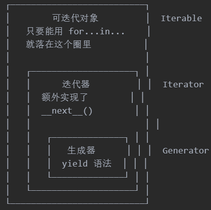

## 一、列表推导式

列表推导式：用一行代码把迭代对象遍历一遍，取出想要的元素，添加到新生成的列表中。

格式：[表达式 for 变量 in 迭代对象 条件]

注意：在推导式不允许出现else elif

- for循环传统用法

```python
new_data = []
for i in range(1,10):
    new_data.append(i)
print(new_data)
```

- 用for循环在1~10中取出偶数的元素

```python
new_data = []
for i in range(1,11):
    if i % 2 == 0:
        new_data.append(i)
print(new_data)
```

- 取1~10之间的每个元素平方数(用列表推导式实现)

```python
data = [i**2 for i in range(1,11)]
print(data)
```

- 取1~10之间的质数(传统写法)

```python
# 除了2，所有偶数都不是素数
for i in range(2,11):
    is_prime = True  # 先假设是质数
    for j in range(2,i):
        if i%j == 0: # 不是质数
            is_prime = False
            break
    if is_prime:
        new_data.append(i) # [2, 3, 5, 7]
print(new_data)
```

- 取1~10之间的质数(列表推导式实现)

```python
data = [i for i in range(2, 11) if all(i % j for j in range(2, i))]
print(data)          # [2, 3, 5, 7]
```

- 判断字符串里的每一个字符是否为整型(列表推导式实现)

```python
a = [['a','b','c','d'],['43','24','45.5','67','78.7']]
data = [j for i in a for j in i if j.isdigit()]
print(data)
```


## 二、迭代器

是一个可以记住遍历的位置的对象，从集合的第一个元素开始访问，直到所有的元素被访问完结束。

有两个特殊的方法：__iter、__next__（返回序列的下一个元素）

- 创建迭代器

```python
# 创建迭代器
a = [1,2,3,4,5]
new_iter = iter(a)
try:
    while True:
        res = next(new_iter) # 返回迭代器下一个元素
        print(res)
except StopIteration: # 迭代器元素耗尽了,就引发StopIteration异常
        pass
```

## 三、生成器

更简单点理解生成器就是一个迭代器在调用生成器运行的过程中,每次遇到 yield 时函数会暂停并保存当前所有的运行信息，返回 yield 的值, 并在下一次执行 next() 方法时从当前位置继续运行。

生成器对象内部有指针，指向当期位置。

- 生成器表达式

```python
gen = (x for x in range(5))
# 得到一个生成器对象，这个对象是懒惰的
```


- 创建生成器

```python
def generator():
    for i in range(5):
        yield i
for num in generator():
    print(num)
```

- 生成器和列表的区别

```python
import sys
# 创建一个包含大量元素的列表
large_list = [i for i in range(1000000000)]
print(f'Size of large_list:{sys.getsizeof(large_list)} bytes')
# 创建一个迭代器用于生成大量元素
large_generator = (x for x in range(1000000000))
print(f'Size of large_generator:{sys.getsizeof(large_generator)} bytes')
```

- 迭代对象、迭代器、生成器三者关系
  

## 四、装饰器

装饰器是一种语法糖，在不修改原代码情况下，给函数动态新增功能。

```python
# 装饰器的定义，写一个装饰器（timer），实现函数执行时间计算
def timer(orig_func):
    def original_timer(*args,**kwargs):
        start_time = time.perf_counter() # 开始计时cpu时间
        orig_func(*args,**kwargs)
        end_time = time.perf_counter() - start_time
        print(f'{orig_func.__name__}耗时: {end_time:.3f}s')

    return original_timer
#@timer
#peace_request = timer(peace_request)
@timer
def peace_request():
    total = sum(range(1, 1000000001))
    print(total)  # 输出 5050
peace_request()
```


## 五、上下文管理器

是一种用于资源管理的协议，确保资源（如文件、网络连接、锁等）在使用后能被正确释放，即使发生异常也能清理资源。

- 基础语法：with语句

```python
with 上下文管理器 as 变量:
    # 使用资源
# 自动释放资源
```

- 两种实现方式

```python
class MyContext:
    def __enter__(self):
        print("进入上下文")
        return self  # 返回值会赋给 `as` 后的变量

    def __exit__(self, exc_type, exc_val, exc_tb):
        print("退出上下文")
        # 返回 True 可抑制异常（不推荐）

# 使用
with MyContext() as ctx:
    print("执行中...")
# 输出：
# 进入上下文
# 执行中...
# 退出上下文
```

