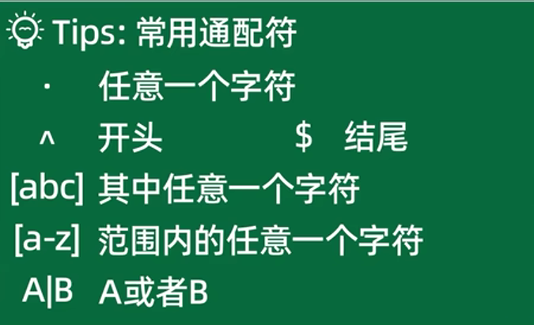
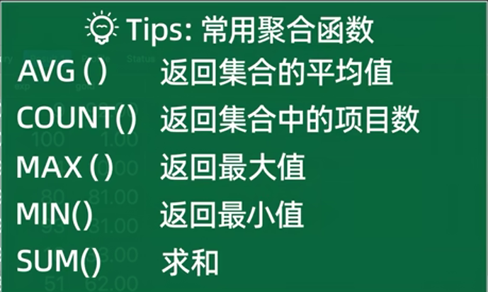

## 一、引用、深拷贝与浅拷贝

引用：变量与数据建立引用(内存地址)，并不是拷贝某个数据,引用不会申请内存

```python
a = 'hello'
b = a
print(f'a:{a}') # 'hello'
a = 'haha'
print(f'b:{b}') # 'hello'
c = ['1','3','4']
d = c # ['1','3','4']
print(d) # ['1','3','4']
c = ['a','b','c']
c[2] = {'abc':123} # ['1','3',{'abc':123}]
print(c) # ['a','b',{'abc':123}]
print(d) # ['1','3','4']
```

- 浅拷贝：只拷贝对应的内存地址（拷贝最外面一层）  copy.copy()

  除了不可变对象（如整数、字符串、元组）不受影响。

  ```python
  # 浅拷贝
  a = [1,2,3,4]
  print(f'a:{a}') # [1,2,3,4]
  b = copy.copy(a)
  a[0] = 6
  print(f'a:{a}') # [6,2,3,4]
  print(f'b:{b}') # [1,2,3,4]
  
  c = [1,['a','c'],4]
  print(f'c:{c}') # [1,['a','c'],4]
  d = copy.copy(c)
  c[1][1] = 'g'
  # c[2]['abc'] = 'haha'
  print(f'c:{c}') # [1,['a','g'],4]
  print(f'd:{d}') # [1,['a','g'],4]
  ```

- 完全复制拷贝一份新的。 copy.deepcopy(),

​    只要碰到可变的数据，就会copy重新一份

```python
e = [1,['a','c'],4]
print(f'e:{e}') # [1,['a','c'],4]
f = copy.deepcopy(e)
e[0] = 'hehe'
print(f'e:{e}') # ['hehe',['a','c'],4]
print(f'f:{f}') # [1,['a','c'],4]]
```

**不可变对象（如 int、str、tuple）** 深浅拷贝结果一样，因为它们本身不能被修改。**

## 二、SQL增删改查（CRUD）

DDL(数据定义语言): create drop alter truncate

DML(数据操作语言)：insert update delete call

DQL(数据查询语言)：select

DCL(数据控制语言)：grant revoke

- 字段(重复的行)去重

```sql
select distinct 列1，列2 from 表名
```

- 查询表格的结果

```sql
desc 表名; # 查看表的结构
```

- 数据库的导入导出

```python
mysqldump -u root -p 数据库名 > 数据库名.sql  #导出sql数据
mysql -u root -p 数据库名 < 数据库名.sql      #导入数据库
```

### select

select检索（查询）、单列、多列、所有列

- 查询所有字段

```sql
select * from 表名; # 查询所有字段
```

- 按指定的字段的值查询

```sql
select * from 表格名 where 字段名 in(值1，值2，);
```

- 指定范围查询

```sql
 select * from 表格名 where 字段名 between 开始值 and 结束值;
```

- 模糊查询

```python
select * from 表格名 where 字段名  like '林%'; # %林%  林_（两个字） 林__(三个字)
```

- 正则表达式

```python
select * from 表格名 where 字段名 regexp '^林.$';
```



- 查询为空的字段

```sql
select * from 表格名 where 字段名 <=> null; # 字段名=''
```

- 排序

```sql
select * from 表格名 order by 字段名; # 升序
select * from 表格名 order by 字段名 desc; # 降序
select * from 表格名 order by 字段名1 desc,字段2; # 字段2升序排
select * from 表格名 order by 字段名1 desc,字段2 desc; # 字段2降序排
select * from 表格名 order by 字段 desc limit 前几; # limit 前几,到几
select * from 表格名 order by 字段名 limit 5 offset 5; # 查询第6条~第10条记录(按字段升序)
```

- 聚合函数

```sql
select 聚合函数(字段名) from 表格名;
```



- 分组

```sql
select 字段名1,count(*) from 表格名 group by 字段名1;
```

- 去重

```sql
select distinct,字段名 from 表格名
```

-  合并查询结果

```sql
第一条 union all 第二条
```

- 查询多条结果的交集

```sql
第一条 intersect 第二条
```

- 查询多条结果的差集

```sql
第一条 except 第二条
```

### alter

```sql
alter table 表名 modify column 字段名 varchar(200); # 修改表格某个字段的结构
alter table 表名 rename column 旧字段名 to 新字段名; # 修改表格某个字段名
alter table 表名 alter column 字段名 set default 值; # 修改字段的默认值
alter table 表名 add column 字段名 datetime; # 新增last_login字段
alter table 表名 drop column 字段名; # 删除last_login字段
```

### drop

```sql
drop table 表名; # 删除整个表格
drop database 数据库名; # 删除数据库
```

### insert

```sql
insert into 表名(字段1,字段2,字段3,字段4,字段5) value(值1,值2,值3,值4,值5); # 插入单条数据
insert into 表名(字段1,字段2,字段3,字段4,字段5) value(值1,值2,值3,值4,值5),(值1,值2,值3,值4,值5); # 插入多条数据
```

### update

```sql
update 表名 set 字段名=新的值 where 字段名=值; # 指定修改某个字段的值
update 表名 set 字段名=0,字段名=0; # 一次性修改多个字段的值
```

### delete

```sql
delete from 表名 where 字段名=0; # 清楚某个字段的值为0
```


## 表关联

- #### 内连接（inner join）

```sql
select 列名 FROM 表1
inner join 表2 on 表1.关联字段 = 表2.关联字段;
```

- #### 左连接（left join）

```sql
select列名 from 表1 left join 表2
on 表1.关联字段 = 表2.关联字段;
```

- #### 右连接（right join）

```sql
select 列名 from 表1 rifht join 表2
on 表1.关联字段 = 表2.关联字段;
```


## 实现单例模式

```python
class Singleton(object):
    _instance = None

    def __new__(cls, *args, **kwargs):
        if not cls._instance: # None
            cls._instance = super(Singleton, cls).__new__(cls)
        return cls._instance # obj

    def __init__(self, value): # self.
        self.value = value # 100
```

## 查漏补缺

- 两个字典合并

```python
a = {'a':123,'b':456}
b = {'c':123,'d':456}
b.update(a) # {'c': 123, 'd': 456, 'a': 123, 'b': 456}
```

