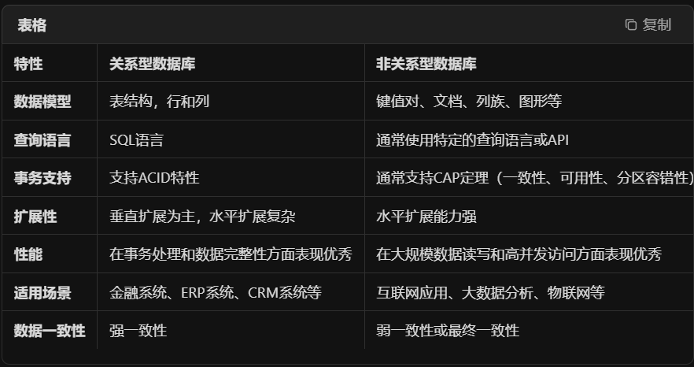

## 1、map()的用法？

map(函数，迭代对象)

返回是一个惰性迭代对象，需要用到列表或for转换

## 2、用random取小数的方法？

random.uniform(开始值,结束值)

## 3、断言是什么?

断言是一个调试工具，检查某个条件是否满足，条件不成立就会返回False,并抛出异常信息

assert 条件 ’可自定义错误信息‘

## 4、如何消除重复的字段，并且消除重复的行(sql语句)

select distinct 列1，列2 from 表名

## 5、python2和python3的区别，请列举5个？

1、打印方法：python2打印方法是prin 字符串；python3是打印函数print()

2、除法运算：3/2=1(python2) 3/2=1.5(python3)

3、python2的range()返回的是列表，python3的range()返回是惰性迭代器

4、输入函数：input()返回是字符串(python2)；合并input()(python3)

5、异常语法

```python
# python2
try:
    ...
except Exception,e:
    print e

# python3
try:
    ...
except Exception as e:
    print(e)
```


## 6、字符串去重的方法是什么？按字母大小排序方法是什么？

用set()方法去重：''.join(sorted(set(字符串)))

`sorted()` 方法默认是从小到大排序；

sorted(reverse=True):从大到小排序


## 7、字典中按键的大小排序方法？

sorted()

## 8、collections库的Counter方法?

Counter是可以接收一个迭代对象，返回一个计数字典，键是元素，值也是元素的出现次数


## 9、用正则过滤掉英文和数字的方法？

```python
re.sub(r'[a-zA-Z0-9]', '', 字符串)
```

## 10、filter的方法？

filter()可以接收函数和迭代对象，对迭代对象中的元素在函数中筛选，返回的是一个迭代器，可以用list、tuple转换为具体的迭代对象

## 11、正则re.complie作用是什么？

用于正则表达式字符串编译成一个正则表达式对象，这个对象可以被用来执行、搜索、替换等操作，从而提高效率。

## 12、绘制统计图的第三方库或开源库有哪些？

Matplotlib、Seaborm、Plotly、Pyecharts

## 13、正则（.*）和（.*?）匹配区别？

.*：贪婪模式，表示尽可能多匹配字符

.*?：非贪婪模式，表示尽可能少匹配字符

## 14、re.sub的用法？

用于在字符串中查找匹配正则表达式字串，并将替换为指定的字符串。

re.sub(匹配字符串中的字串,原有的字符串)

## 15、字符串如何编译成bytes类型？

```python
# 编译成bytes类型
字符串.encode(encoding='utf-8')

# 反向操作
bytes.decode(encoding='utf-8')
```

## 16、mysql和redis的区别是什么？

mysql是一种关系型数据库管理系统，使用SQL(结构化查询语言)进行数据操作；redis是一种键值存储的非关系数据库，数据以键值对的形式存储

## 17、关系型数据库与非关系型数据库



## 18、如何用正则匹配日期，格式：2018-03-20

```python
# 定义正则表达式
pattern = r'\d{4}-\d{2}-\d{2}'
# 测试字符串
text = "今天的日期是2018-03-20，明天是2018-03-21。"
# 匹配日期
matches = re.findall(pattern, text)
print(matches)  # 输出：['2018-03-20', '2018-03-21']
```

## 19、列表除了sort从小到大排序，还有什么方法可以实现？

sorted()是一个内置函数，可以接收任何迭代对象进行排序，并返回一个新的列表(不会修改原列表)

## 20、常见MYSQL数据存储引擎有哪些？

InnoDB、MyISAM、Memory、Archive等