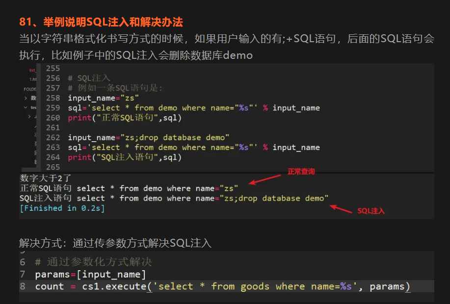

## 1、同源策略是什么？

协议相同、域名相同、端口相同；只要不满足任意一个，就不是同源策略。

## 2、简述cookie和session的区别？

1，session 在服务器端，cookie 在客户端（浏览器）

2、session.id存储在cookie，如果访问浏览器禁止了cookie，那么session也会失效

3、cookie安全性比session差

## 3、简述多线程、多进程

1. 多线程：在一个程序中，存在有多个线程在同时运行，每个线程都是程序执行的最小单位，也是进程的子单位，所有的线程都共享程序资源(内存空间)
2. 多进程：在多个程序同时运行时，一个程序就是一个进程，每个进程运行都互不干扰，都拥有各自独立的资源（内存空间）

## 4、IndentationError、IndexError分别代表是什么异常？

1. IndentationError：代码没有对齐
2. IndexError：下标超过了序列的边界

## 5、列出几种魔法方法并简要介绍用途

1. __new__:在实例类时，就调用这个方法，new之后得到该类实例化的对象
2. __init__:类实例化对象的初始化方法
3. __del__:删除对象执行的方法
4. __str__:打印从这个方法中的return数据
5. __repr__:返回对象”官方“字符串表示形式，用于调试和开发

6、C:\Users\ry-wu.junya\Desktop>python 1.py 22 33命令行启动程序并传参，print(sys.argv)会输出什么数据？

argv是sys模块的一个列表，列表第一个元素是脚本名称，其它元素是命令行传入的参数

['1.py','22','33']

## 7、使用lambda函数对list排序foo = [-5,8,0,4,9,-4,-20,-2,8,2,-4]，输出结果为[0,2,4,8,8,9,-2,-4,-4,-5,-20]，正数从小到大，负数从大到小

foo = [-5,8,0,4,9,-4,-20,-2,8,2,-4]

new_foo = sorted(foo,key=lambda x:(x<0,abs(x)))

print(new_foo )

## 8、举例说明SQL注入和解决办法

